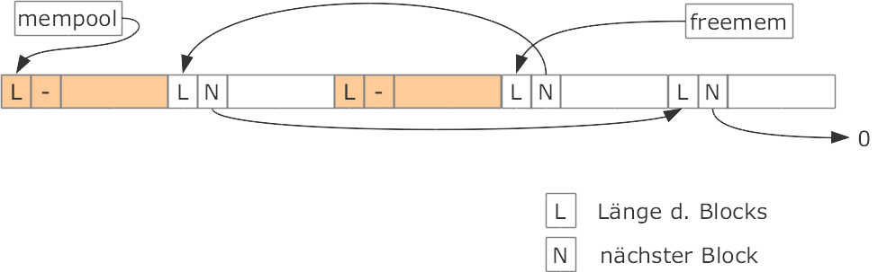

# Blatt 04: Speicherverwaltung [C11] (P)


## Hinweise

Die Vorgaben zu diesem Blatt finden Sie im Repo ```git@git03-ifm-min.ad.fh-bielefeld.de:cagix/sp-w21-vorgaben.git```.

Sie finden dort im Ordner tests/speicherverwaltung/ eine Testsuite und ein Makefile, welches Ihnen die Targets test_speicherverwaltung und test_speicherverwaltung_split mit den Vorgabe-Tests anbietet (einmal für Malloc in der Basisversion ohne Split und einmal für die Version mit Split).

Dieses Makefile erwartet Ihre Lösung in den beiden bereits im Repo angelegten Ordnern include/ und src/, d.h. das Headerfile als include/speicherverwaltung/speicherverwaltung.h und die Implementierung (ohne main()-Funktion!) in src/speicherverwaltung/speicherverwaltung.c.

Betrachten Sie diese Tests als ausführbare Spezifikation in Ergänzung zur schriftlichen Aufgabenstellung.

## GDB (2P)

Arbeiten Sie sich selbstständig in die Nutzung des Debuggers GDB (aus dem GCC-Paket) ein.

Demonstrieren Sie in der Abgabe, wie Sie die in diesem Blatt implementierten Funktionalitäten mit dem GDB von der Konsole aus debuggen können. Dabei müssen Sie mindestens die bereits vom Debuggen unter Java bekannten Funktionalitäten zeigen: Breakpoints setzen und löschen, sich Variableninhalte anzeigen lassen sowie in eine Funktion springen bzw. zum nächsten Breakpoint fortfahren.


## Basis des simulierten Heaps

- Der Heap soll durch ein Byte-Array mempool simuliert werden: char mempool[MEM_POOL_SIZE]. Die Größe des Heaps (Konstante MEM_POOL_SIZE) soll mindestens 4096 Bytes betragen.
- Die freien Blöcke sollen über eine einfach verlinkte Liste verwaltet werden.
    
    - Der Pointer freemem (Typ: memblock*) zeigt immer auf den Anfang der Freispeicherliste. Wenn es keine freien Blöcke mehr gibt, hat freemem den Wert NULL.
    - Jeder Block (frei und belegt) beginnt mit einer Verwaltungsstruktur memblock:
    ```c
    typedef struct memblock {
    size_t size;            // Für User nutzbare Länge des Blocks [Bytes]
    struct memblock *next;  // Zeiger auf Anfang des nächsten freien Blocks (oder NULL)
    unsigned short id;      // Fortlaufende und eindeutige Nummer des Blockes
    } memblock;
    ```
- Belegte Blöcke sollen nicht in der Liste verwaltet werden, behalten aber ihre Verwaltungsstruktur. Zur Markierung soll der next-Pointer den “magischen” Integerwert 0xacdcacdc haben (Konstante MAGIC_INT). Zur Vereinfachung des Debuggens erhält jeder belegte Block bei der Allokation eine fortlaufende und eindeutige Nummer.


## Strukturen und Variablen (1P)

1. Definieren Sie die oben genannten Konstanten mittels #define in speicherverwaltung.h.
2. Definieren Sie die struct memblock und den Typ memblock in speicherverwaltung.h.
3. Definieren Sie den simulierten Heap mempool und den Pointer freemem als globale Variablen in speicherverwaltung.c. Deklarieren Sie diese zusätzlich in speicherverwaltung.h.


## Initialisierung (1P)

Schreiben Sie eine parameterlose Funktion int cm_init(void), die den simulierten Heap initialisiert und den Pointer freemem auf den Beginn der Freispeicherliste zeigen lässt (speicherverwaltung.[h,c]).

Die Funktion darf den Heap nur beim ersten Aufruf initialisieren. Nutzen Sie dafür keine globale Variable!

Rückgabewerte: +1, falls der Heap korrekt initialisiert wurde. 0, falls der Heap bereits initialisiert war (durch einen früheren Aufruf von cm_init()). -1, falls beim Ausführen der Funktion ein Fehler auftrat.

Der initiale (leere) Heap wird als ein einziger freier Block betrachtet. Auch wenn freie Blöcke sonst keine eigene Nummer bekommen, vergeben Sie für den initialen freien Block hier die Nummer 0.

Diese Funktion muss einmal aufgerufen werden, bevor Sie cm_malloc() etc. nutzen können!

# Eigenes Malloc (4P)

Implementieren Sie die Funktion void *cm_malloc(size_t size) (speicherverwaltung.[h,c]), die analog zu malloc() aus der C-Standardbibliothek mit dem first-fit-Verfahren nach dem ersten freien Speicherblock sucht, der eine nutzbare Größe von mindestens __X__ Bytes (mit __X =__ size Bytes) hat:

- Im Erfolgsfall findet der Suchalgorithmus einen Block mit einer nutzbaren Länge von __Y__ Bytes mit __Y >= X__.  
Der gesamte Block wird alloziert und ein Pointer auf den Beginn des Nutzdatenbereichs des Blocks wird zurückgeliefert. Der allozierte Block erhält eine fortlaufende Nummer. Nutzen Sie dafür keine globale Variable!
- Falls kein ausreichend großer Block gefunden wird, soll ein NULL-Pointer zurückgeliefert werden.

Für Aufrufe mit 0 (also size=0) darf der Heap nicht verändert werden; Rückgabe: NULL-Pointer.

Zur Suche nach einem freien Block darf cm_malloc() nur die Freispeicherliste nutzen! Wenn dabei ein Fehler bei der Verlinkung in der Freispeicherliste feststellt wird, soll abgebrochen und ein NULL-Pointer zurückgeliefert werden.

Da die Nummer 0 bereits für den initialen (leeren) Block vergeben wurde, startet cm_malloc() mit 1 …

Erweitern Sie die Basisversion der Funktion void *cm_malloc(size_t size): Gefundene Blöcke sollen vor der Allokation aufgeteilt (“gesplittet”) werden, falls sie “deutlich” größer sind als der angeforderte Speicher.

Zusätzlich zur obigen Beschreibung für die Basisversion soll nun im Erfolgsfall gelten:

- Falls sogar gilt: __Y > X + 2 x |Verwaltuksstruktur [Bytes]| + 32 Bytes__ , dann soll der Block gesplittet und der Rest (der hintere Teil) als neuer freier Block anstelle des ursprünglichen Blocks in die Freispeicherliste eingehängt werden. Der erste Teil wird wie in der Basisversion belegt und dem Nutzer zur Verfügung gestellt (“alloziert”).
- Anderenfalls (wenn der gefundene Block nur “etwas zu groß” ist): Verhalten wie in der Basisversion.

Das zusätzliche Splitten soll beim Kompilieren über die Compiler-Option MALLOCSPLIT aktiviert werden.

# Eigenes Free (2P)

Implementieren Sie die Funktion void cm_free(void *ptr), die sich ähnlich zu free() aus der C-Standardbibliothek verhält (speicherverwaltung.[h,c]): Der übergebene Block soll als freier Block am Anfang der Freispeicherliste eingehängt werden.

Wenn ptr ein NULL-Pointer oder kein durch cm_malloc() angelegter Pointer ist, soll cm_free() nichts tun, d.h. darf in diesem Fall weder den Pointer ptr bzw. das evtl. verwiesene Objekt noch die Freispeicherliste verändern.

Der freemem-Zeiger wird dadurch irgendwann nicht mehr auf den physikalisch ersten freien Block zeigen.